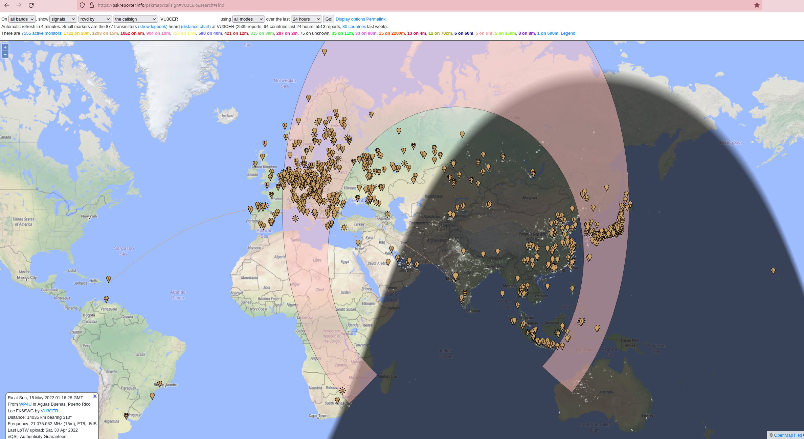
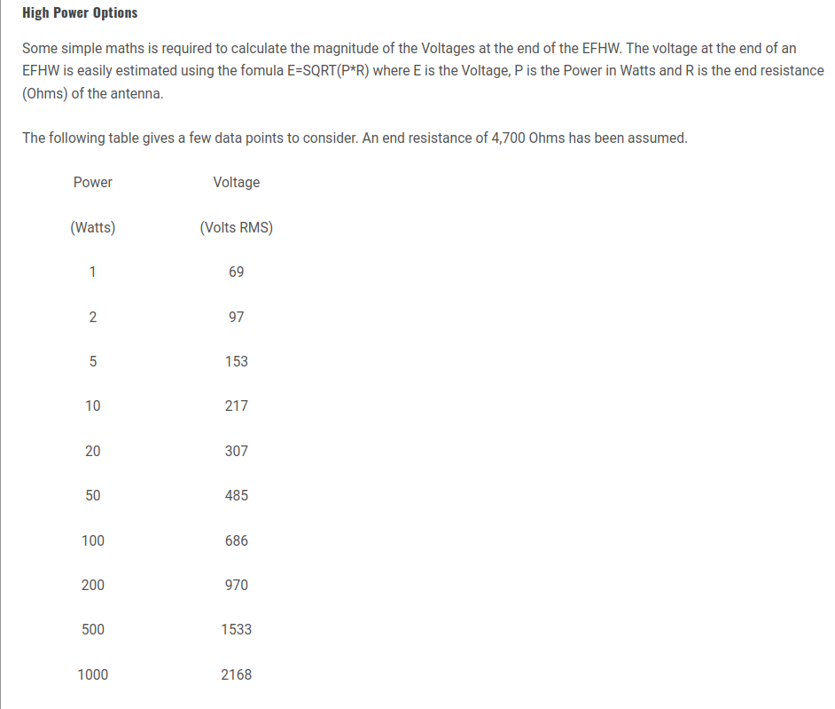

### VU3CER's HF Balcony-Antenna-System

VU3CER's 'HF Balcony Antenna System' is a `Portable, Reproducible, 100%
resonant, Simple, Stealth, Take + Erect Anywhere Antenna System`. This `Antenna
System` is built around an efficient, resonant, robust, convenient, and easy
49:1 EFHW (End-Fed Half-Wave) antenna at the core.

Supported bands: 40-20-17-15-10. No tuner required.

Motivation: The year is 2022, and property prices have risen to insane levels -
new-generation HAMs with modest family backgrounds can't afford independent
`large row houses (bungalows)` to install 128-element 180m (and all-band) beam
antennas on. Furthermore, HOA / apartment societies (where many new-generation
HAMs live) typically don't allow free access to the terrace. What can an
enthusiastic HAM do in such circumstances?

Are you a new HAM trying to debug your equipment, and get on air within one
day? We strongly recommend using the extremely popular and always-on `FT8`
digital mode for these purposes. Checkout the following URLs and projects as
well.

- https://github.com/kholia/Light-Intuitive-Digital-Interface
- https://github.com/kholia/Easy-Digital-Beacons-v1
- https://github.com/kholia/Easy-Field-Strength-Meter
- https://github.com/kholia/Simple-TR-Switch
- https://github.com/kholia/Easy-Transceiver
- https://github.com/kholia/HF-PA-v5
- https://pskreporter.info/ (monitor your TX signals here)

Note: Please follow all safety precautions as always! Heights are DANGEROUS!

Note 2: The `screenshots` folder contains the QSO reports.

Update (15-May-2022): The 'HF Balcony Antenna System' also works great as a
simple 'Window Antenna System' (WAS). I simply flung the wire outside the
window - no fishing pole or supports needed.

Jaipur RX (May-2022):

TX spread on the 17m band.

JP QSO.

Note 3: The RX performance is Good Enough (TM) even on a First-Floor's Balcony.

Some action on the 15m band as well ;)

A WIP photo of the 49:1 transformer.

SWR for 20m band.

Choosing a capacitor according to wattage (https://www.sotabeams.co.uk/efhw/):

#### BOM

The total cost of this antenna system is ~1600 INR or less.

- 10 meters RG-58 or HLF-200 with PL-239 connectors (10 meters is required even when 50 cms is enough!). For ensuring capacitive ground coupling! - 350 INR

  - BNC-Male to SO-239 adapter - 50 INR (required for IC-705)

  - https://www.rfconnector.in/ has the best quality + prices for all-things-RF. Do mention that VU3CER (Dhiru) sent you.

- `Caperlan First Fish 500` - 5m telescopic fishing pole - 650 INR from Decathlon.

- Small PVC piece (~1m 1.25" SCH-40) to support the fishing pole [Optional] - Free from a local hardware shop with some communication skills ;)

- Finolex / Polycab 0.75 sq. mm. PVC coated wire - ~10m meters (for 20m band, half-wave length)  - don't cut the wire for *fine-tuning* - just roll the wire end in tight circles as needed. Yellow wire is more fun than Black - ~100 INR.

  Feel free to use 1 sq. mm. or thicker cables with due care.

- 49:1 EFHW Transformer (FT140-43 core from Semikart + 19 or 20 SWG Winding Wire from `Project Point` + 100pF 3kV (or 2 kV) ceramic capacitor from `Orbit Electronics`) - ~150 INR

  Transformer parameters: 2 primary and 14 secondary turns with crossover wire - for 20m and up.

- Enclosure: 'CircuitX Plastic Enclosure - Medium (PEM02)'. https://www.probots.co.in/plastic-enclosure-medium-pem02.html.  8.2 cm x 5.8 cm x 2.7 cm - 50 INR only

- [Optional] IP65 Box - ~80x82x55 size works fine - smaller size is easily possible too. Bhadra Enclosures - BE-885 AS model - For outdoor use - ~200 INR

- Misc hardware: Eyelet hook (M6 to M8 size works, other sizes are fine too) + double-screws + double-washers, Wing nut + washers + screws, SO-239 chassis mount connector - ~200 INR.

  - 0.75" round clamp with rubber cushion [Optional] - This can be useful for resting the fishing pole on the outer PVC pipe easily.

  - Bohri Ali (Pune): 'Ramanlal & Sons' + Burhan Hardware + 'Premier Hardware'.

  - Get from your local hardware market.

  Note: A regular lanyard cable works fine with the 'CircuitX Plastic Enclosure - Medium (PEM02)' enclosure.

- Coax Common Mode Chokes (1:1). OPTIONAL (strongly depends on your operating conditions and setup)

  - DIY using FT240-43 + 12 turns of RG-58 cable (with crossover).
  - Many videos on YouTube. E.g. https://www.youtube.com/watch?v=fFz9Z-TRtnQ.

  - Alternate: FT140-43 + 8 turns of RG174 cable (with crossover)

  - Case from https://www.probots.co.in (Medium - PEM03) - 70 INR

- Special DIY `chippa` for attaching and guiding the wire through the fishing
  pole - Make from waste plastic lid or something

  - https://www.youtube.com/watch?v=dCXdCLpnju0

- Duct tape + plastic "packing wire" spool - required as always

- For multi-band tuning, use a twist tie - details below ;)

- For 40m operations, a DIY 34µH loading coil is required. See the `References` for details.

Note: See the `images` folder for sample BOM photos.

#### Tips

- Raise the pole up at 45 degrees (or more) and drop down the remaining cable
  portion (if any) from the end of the pole.

- The wire "exits" the 49:1 transformer, climbs up the fishing pole, and then
  drops down at the end of the fishing pole.

- Don't worry about getting the exact parts (except the FT140-43 or larger
  43-mix toroid), use what you have and feel free to modify this antenna system
  as per your requirements.

- For making a QRO EFHW transformer, see the `References` section.

  BOM: 2 x FT240-43 toroids, 100pF 15kV (blue) ceramic capacitor, 10x10 cms
  box, 16 SWG enamelled copper wire (winding wire).

- We recommend using NanoVNA to tune the antenna.

#### Observations

- Tuning the antenna is trivial - few minutes + rough guesswork are more than enough.

- SWR is not affected easily by surroundings.

- No tuner is required nor recommended - resonant antennas rock!

- The same antenna works fine for 17m, 15m, and other bands by adjusting the
  wire length. Don't cut the 10m wire (for the 20-meter band). Just roll the
  dangling end into tight small circles (using a twist tie) and get the antenna
  system to tune on 17m and 15m without problems.

  This no-compromise *manually tuned* multi-band antenna system gets your butt
  exercised as well :D

- Pretty broadband even with 0.75 sq. mm. wire (~500 kHz with < 2.0 SWR) - this
  one is hard to explain, but I am not complaining.

- TX efficiency is ~80%.

- No problem of common-mode currents usually! This is where the 10-meter coax on the ground (aka "the floor") helps with.

- SWR can be 1.04 even under non-ideal conditions. Don't be surprised by it.

- This antenna system works fine with IC-705, and uBitx (well, no surprises here).

- If your balcony is on the 25th floor, don't be surprised if you get DXCC within a week ;)

- The same antenna design becomes a remote terrace multi-band antenna when used
  with 63-to-66 feet of wire. See the `References` for details.

- Note: This proven antenna design is sold commercially by multiple vendors. It
  is NOT something new/novel (which is actually great!).

#### Comparison against Magnetic Loop

- The VU3CER HF Balcony-Antenna-System can gain free space! - a magloop in a
  typical apartment balcony cannot do this.

- We are able to achieve awesome SWR values (by gaining free space
  essentially). A magloop has a high (TX) SWR in typical, constricted (3 x 12
  feet) apartment balconies.

  A perfect 1.01 SWR magloop may become 3+ SWR magloop in constricted spaces -
  well nothing new here.

  Buying a tuner for your magloop is not a solution - switch to VU3CER HF
  Balcony-Antenna-System instead ;)

- TX efficiency of this system is way higher (on 20-17-15) than that of typical
  commercial magloops (AlexLoop, Chameleon offerings).

- This antenna system can handle QRO levels of power (see `References`) - a
  typical commercial magloop (even costing 450 to 600 USD) can't do this.

- Commercial and even homebrew magloops can be expensive - our antenna system
  is dirt cheap in comparison.

- The constantly required manual tuning (required even within a single band)
  process for magloops becomes exhausting pretty quickly. They are known to
  have poor bandwidth on common HF bands.

  The VU3CER HF Balcony-Antenna-System has ~500 kHz bandwidth with < 2.0 SWR
  on the 20m band.

I have the Chameleon MagLoop(s) and some other ones as well - they were tested
in the same balcony. I have lost interest in, and the love for magloops after
testing the VU3CER HF Balcony-Antenna-System ;)

I wonder how a VHF magloop will work out... (aka a future project for fun).

#### FAQ

- What can I do if my housing society (AKA housing complex) doesn't allow
  'hanging' a fishing pole?

  You have various options:

  - Operate late at night - less chance of getting your antenna spotted.

  - Use a YouLoop / Magloop for RX - There are multiple ways to enjoy the
    amateur radio hobby - flexibility, and adaptability are biggest personal
    assets ;)

  - Operate from the field (SOTA + POTA). Also, operate from the field even if
    you have a 128-element all-band Yagi antenna at home - it's fun!

  - Icom AH-4 tuner with 7m+ of "random" wire might work better for you!?

  - Yaesu ATAS-120A Auto Active Tuning Antenna (only 1.6m long!) works decently
    enough if your balcony has the height advantage (like it is on the 30th
    floor).

  - On large balconies (with depth available), a RX/TX magloop could be a
    decent option. QRO magloops can be expensive though.

  - WebSDRs can be fun too for RX purposes - give them a try!

    http://websdr.org/ and http://kiwisdr.com/ are some good places to start.

  - VU2ASH's `Indoor EFHW with only a few feet of wire going outside and around
    the balcony` is another viable option.

    This antenna is currently being tested by VU2ASH (Ashok Joshi Sir).

  - VU2BGS has successfully used indoor dipole antennas in Indian hotels (which
    have the usual cement + steel based construction)!

  - Change your housing society ;(

#### References

- http://gnarc.org/wp-content/uploads/The-End-Fed-Half-Wave-Antenna.pdf

- [YouTube Video - The 49:1 Half-Wave End-Fed Antenna Transformer, Part 1](https://www.youtube.com/watch?v=MgZap6xWZLs)

- https://g4tgj.github.io/20m-EFHW-Vertical-Antenna/ (a SOTA adaptation, shortened EFHW)

- 

- https://www.banggood.in/buy/youloop-antenna.html (YouLoop Magnetic Antenna)

- https://github.com/kholia/Budget-RF-Lab (go here next)

Note: Construction of the EFHW transformer takes < 30 minutes. 'Installing' it
takes less than 10 minutes. As usual, visualize the whole process in your head
beforehand for 100% success.

#### Product URLs

- https://www.semikart.com/search/5943002701 (FT140-43)

- https://www.semikart.com/search/5943003801 (FT240-43)

- https://www.semikart.com/search/CCH-100P3000V (branded 3kV or 2kV caps)

- https://projectpoint.in (3kV or 2kV caps, magnetic winding wire, misc)

  Search for `100pF 2kV High Quality Ceramic Disc Capacitor`.

- https://indialocalshop.com/ (misc. hardware)

- http://www.bhadraenclosures.com/ (IP65 cases)

- https://www.probots.co.in/ (cost-effective cases)

- https://vashielectricals.com/ (Polycab / Finolex electrical cables - "antenna wire")

Note: Select `Element14` as the vendor in Semikart. We get pretty awesome
prices in India for these two toroids. Also, Element14's packaging is quite
perfect. Tip: Grow your Semikart cart over time to save (amortize) on the
shipping costs (flat 250 INR). The delivery time from Element14 can often be
under a week for Indian customers.

Note 2: Contrary to the popular pessimistic beliefs, toroids are easily
available in India at pretty nice prices. Don't buy into these shared values of
pessimism and defeatism - enjoy the hobby with a positive, resourceful mindset!
